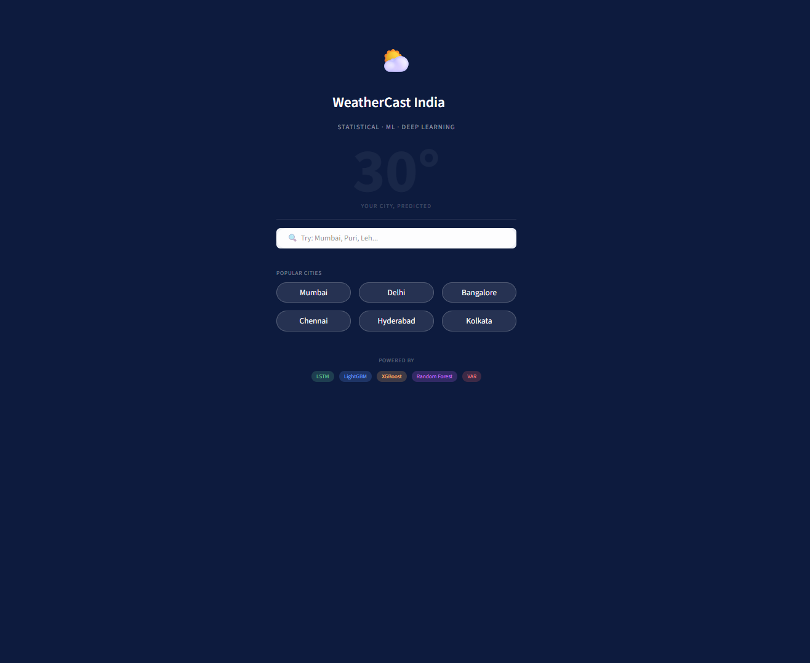
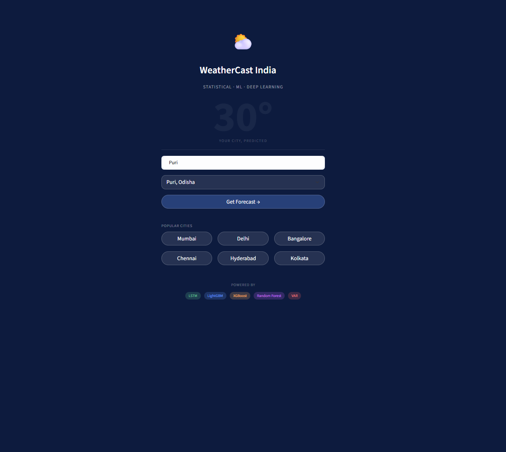
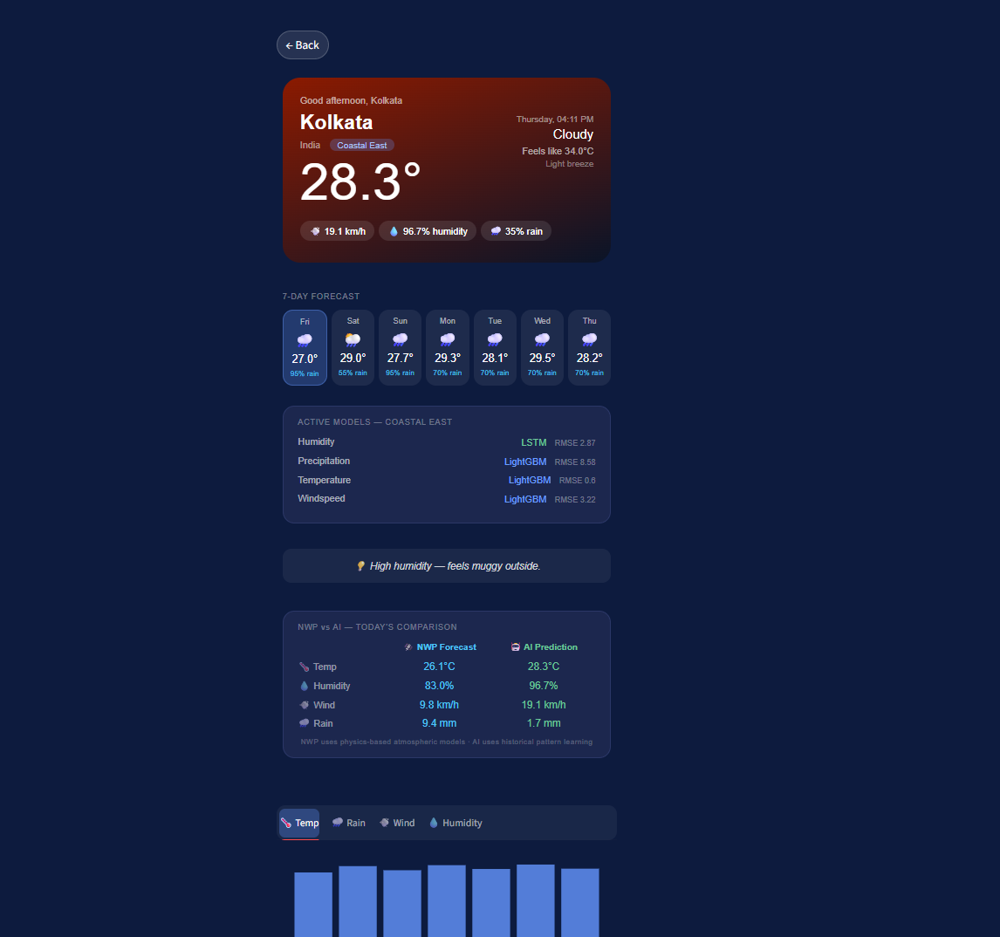
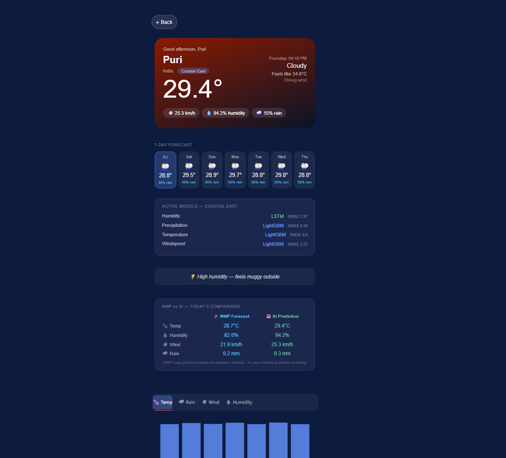
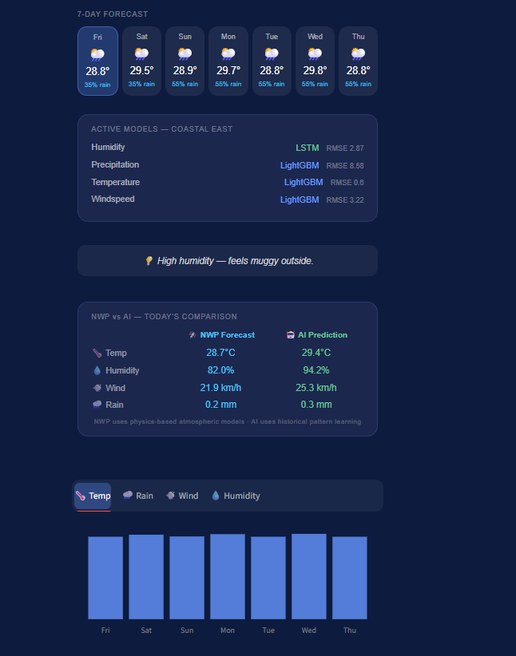
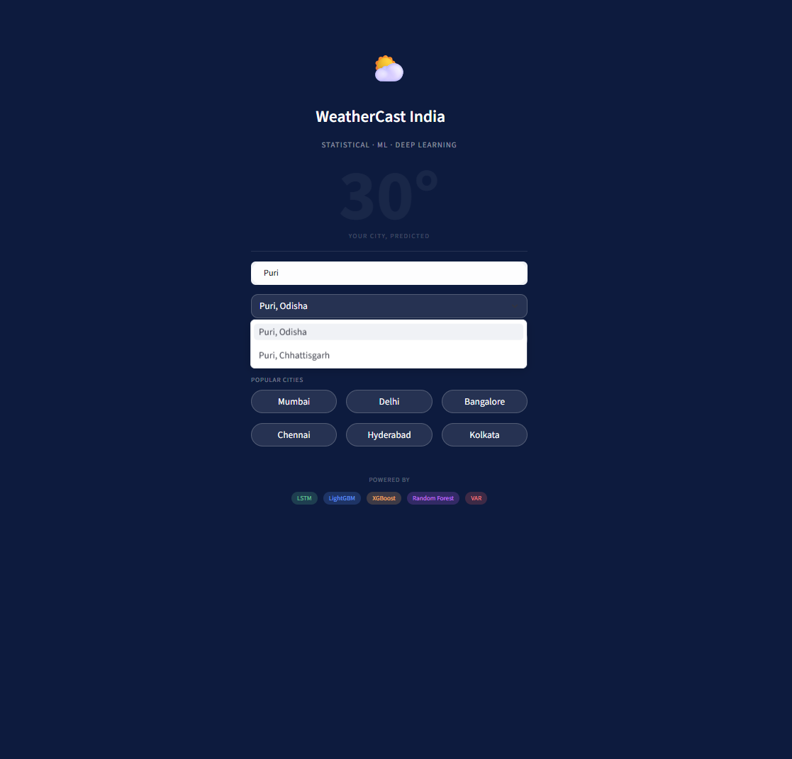

# ⛅ WeatherCast India
### ML-Powered Weather Forecasting for Any Indian City

[](https://weather-forecasting-application.streamlit.app)


> **Statistical · Machine Learning · Deep Learning** — three model families compete. Best one wins.

---

## 🌐 Live Demo

**[weather-forecasting-application.streamlit.app](https://weather-forecasting-application.streamlit.app)**

Search any Indian city and get an AI-powered 7-day weather forecast in seconds.

---

## 📸 Screenshots & Demo

### 🏠 Landing Page


### 🔍 Search


### 🌡️ Weather Forecast Card


### 📅 7-Day Forecast


### 🛰️ NWP vs AI Comparison


### 💡 Smart Suggestions


```
```

---

## 📌 What This Project Does

WeatherCast India is a full-stack machine learning application that forecasts weather for any Indian city using a multi-model competition framework. For each city, three families of models — statistical (VAR), machine learning (LightGBM, XGBoost, Random Forest), and deep learning (LSTM) — are trained on 35 years of historical weather data. The model with the lowest RMSE on a validation set automatically wins and is used for forecasting. Every night, new data is appended and models are retrained, so the system continuously improves.

The app also features a **NWP vs AI comparison card** — showing the physics-based Open-Meteo forecast alongside the ML model prediction, so users can understand the difference between atmospheric simulation and historical pattern learning.

---

## 🏗️ System Architecture

```
User types city name
        ↓
Geocoding API → coordinates → climate zone assignment
        ↓
Fetch last 30 days weather (Open-Meteo Archive API)
        ↓
Load winning model for that zone
        ↓
Recursive 7-day forecast
        ↓
Streamlit dashboard with charts, insights, and NWP comparison

Every night at 12:00 AM IST:
→ Append today's real data to database
→ Retrain all 5 models per zone per variable
→ Replace saved model if new one is better
```

---

## 🗺️ Zone-Based Modeling

India is divided into **6 climate zones**. One model is trained per zone using data from all cities in that zone — with latitude, longitude, and altitude as features so the model knows which city it is predicting for.

| Zone | Description | Cities |
|------|-------------|--------|
| Zone 1 | Arid / Semi-arid | Jaisalmer, Jodhpur, Bikaner, Ahmedabad |
| Zone 2 | Tropical Coastal West | Mumbai, Goa, Kochi, Mangalore |
| Zone 3 | Tropical Coastal East | Chennai, Visakhapatnam, Kolkata, Bhubaneswar |
| Zone 4 | Tropical Interior Deccan | Bangalore, Hyderabad, Pune, Nagpur, Bhopal |
| Zone 5 | Humid Subtropical North | Delhi, Lucknow, Jaipur, Patna, Indore |
| Zone 6 | Highland / Alpine | Shimla, Leh, Dehradun |

**Unknown cities** — if a user searches a city not in the list, the app fetches its coordinates from the API, assigns it to the nearest zone using bounding boxes, and forecasts immediately using the zone model.

---

## 📊 Model Results

Results on **Zone 2 — Tropical Coastal West** (Mumbai, Goa, Kochi, Mangalore):

| Variable | VAR | Random Forest | XGBoost | LightGBM | LSTM | **Winner** |
|----------|-----|---------------|---------|----------|------|------------|
| Temperature | 2.013 | 0.676 | 0.711 | 0.661 | **0.370** | LSTM |
| Precipitation | 16.737 | 9.870 | 10.378 | 9.530 | **9.045** | LSTM |
| Windspeed | 5.159 | 2.703 | 2.793 | **2.582** | 4.181 | LightGBM |
| Humidity | 11.377 | 6.402 | 6.568 | 6.202 | **5.020** | LSTM |

> RMSE units: temperature in °C, precipitation in mm, windspeed in km/h, humidity in %

**Key finding:** LSTM achieves 82% improvement over VAR on temperature (2.013 → 0.370). LightGBM wins on windspeed — chaotic variables favor tree models over sequence models. This validates the per-variable model selection approach.

---

## 🧠 Feature Engineering

Each training sample has **74 features**:

| Feature Type | Count | Description |
|-------------|-------|-------------|
| Lag features | 56 | Past 14 days of all 4 variables |
| Rolling mean | 8 | 7-day and 14-day mean per variable |
| Rolling std | 4 | 7-day standard deviation per variable |
| Calendar | 3 | Month, day of year, day of week |
| Location | 3 | Latitude, longitude, altitude |
| **Total** | **74** | |

---

## 🛠️ Tech Stack

| Layer | Technology |
|-------|-----------|
| Data source | Open-Meteo Archive + Forecast API (free, no key needed) |
| Database | SQLite |
| Statistical model | statsmodels VAR |
| ML models | scikit-learn RandomForest, XGBoost, LightGBM |
| Deep learning | TensorFlow / Keras LSTM |
| Feature engineering | pandas, numpy |
| Dashboard | Streamlit |
| Charts | Plotly |
| Scheduler | APScheduler (BackgroundScheduler) |
| Deployment | Streamlit Cloud |
| Uptime monitoring | UptimeRobot (pings every 5 min) |

---

## 📁 Project Structure

```
weather-forecasting-application/
│
├── data/
│   └── weather.db                  ← SQLite database (25 cities, 35 years)
│
├── notebooks/
│   ├── eda.ipynb                   ← Exploratory data analysis (Mumbai)
│   ├── statistical_models.ipynb    ← VAR + VARMAX demonstration
│   ├── ml_models.ipynb             ← RF + XGBoost + LightGBM demonstration
│   └── dl_models.ipynb             ← LSTM demonstration
│
├── src/
│   ├── database.py                 ← SQLite operations
│   ├── fetch_data.py               ← Open-Meteo API integration
│   ├── zones.py                    ← Zone definitions, city data, coordinate lookup
│   ├── features.py                 ← Feature engineering (74 features)
│   ├── model_statistical.py        ← VAR training function
│   ├── model_ml.py                 ← RF, XGBoost, LightGBM training functions
│   ├── model_dl.py                 ← LSTM training function
│   ├── model_selector.py           ← Trains all models, picks winner, saves to DB
│   ├── predictor.py                ← forecast_city() — main prediction function
│   └── scheduler.py                ← Nightly retrain job (APScheduler)
│
├── saved_models/
│   ├── zone1_arid/                 ← 4 winner models (one per variable)
│   ├── zone2_coastal_west/
│   ├── zone3_coastal_east/
│   ├── zone4_deccan/
│   ├── zone5_north/
│   └── zone6_highland/
│
├── app.py                          ← Streamlit dashboard
├── requirements.txt
└── README.md
```

---

## 🚀 Run Locally

**1. Clone the repository:**
```bash
git clone https://github.com/himanshu-shekhar2327/weather-forecasting-application.git
cd weather-forecasting-application
```

**2. Create virtual environment:**
```bash
python -m venv weather_env
# Windows
weather_env\Scripts\activate
# Mac/Linux
source weather_env/bin/activate
```

**3. Install dependencies:**
```bash
pip install -r requirements.txt
```

**4. Set up database and fetch data (one-time):**
```bash
python src/database.py     # creates SQLite tables
python src/setup.py        # fetches 25 cities (takes ~10 minutes)
```

**5. Train all models (one-time, takes 3-4 hours):**
```bash
python src/model_selector.py
```

**6. Run the app:**
```bash
streamlit run app.py
```

Open `http://localhost:8501` in your browser.

---

## ⚙️ How the Pipeline Works

### Data Collection
Historical weather data (1990–present) is fetched from the Open-Meteo Archive API for all 25 cities. Each city stores daily records of temperature, precipitation, windspeed, and humidity in SQLite.

### Feature Engineering
Raw time series data is converted into a supervised learning format. For each day, 74 features are created: 14 days of lag values for each variable, rolling statistics, calendar features (month, day of year), and location features (latitude, longitude, altitude). This allows tree-based ML models to understand temporal patterns without native time series support.

### Model Training
For each of the 6 climate zones:
- All cities in that zone are combined into one training dataset
- 5 models are trained per variable (20 models per zone, 120 total)
- Each model is evaluated on a held-out 20% test set
- The model with lowest RMSE is saved as the zone's active model

### Prediction
When a user searches a city:
1. Coordinates are fetched from geocoding API
2. City is assigned to a climate zone using bounding boxes
3. Last 30 days of weather are fetched from API
4. Zone's winning models are loaded
5. Recursive 7-day forecast is generated — each prediction feeds the next
6. Results are displayed with weather condition, feels-like temperature, and trend charts

### NWP vs AI Comparison
Alongside the ML prediction, the app fetches a real-time 7-day forecast from Open-Meteo's forecast API (physics-based NWP model). Today's values are shown side by side — NWP Forecast vs AI Prediction — for all 4 variables. This honestly shows users where the ML model aligns and where it differs from atmospheric simulation.

### Nightly Update
Every night at 12:00 AM IST, the BackgroundScheduler fetches today's actual weather for all 25 cities, appends to the database, retrains all models, and replaces saved models if new ones perform better.

---

## 📱 App Features

- 🔍 **Smart search** — autocomplete suggestions with city and state name
- 🎨 **Time-based themes** — morning orange, afternoon red, evening navy, night dark
- 🌡️ **Today's forecast** — temperature, feels-like, condition, wind, humidity, rain probability
- 📅 **7-day forecast** — daily cards with weather icons and rain probability
- 🤖 **Model transparency** — shows which model won per variable with RMSE score
- 🛰️ **NWP vs AI comparison** — physics-based forecast vs ML prediction side by side
- 💡 **Smart suggestions** — context-aware weather advice
- 🌧️ **Rain animation** — animated rain drops when it is raining
- 📊 **Trend charts** — interactive bar charts for temperature, rain, wind, humidity

---

## 🎯 Purpose of This Project

WeatherCast India is **not** meant to replace IMD or weather.com. Its purpose is to demonstrate:

1. **Automated model selection** — 5 models compete per variable per zone, best one wins automatically based on RMSE
2. **Zone-based generalization** — works for any Indian city, not just pre-loaded ones
3. **End-to-end MLOps pipeline** — data collection → feature engineering → training → evaluation → deployment → nightly retraining
4. **Honest ML** — the NWP vs AI comparison card shows exactly where ML models align and differ from physics-based atmospheric simulation

> *"The value is in the pipeline and the comparison — not in beating a supercomputer-based weather system."*

---
## 🚀 Deployment

This app is deployed on **Streamlit Cloud** and kept alive 24/7 using **UptimeRobot**.

| Detail | Info |
|--------|------|
| Platform | Streamlit Cloud |
| Python version | 3.11 |
| TensorFlow | Pinned to 2.21.0 (stability) |
| Uptime monitoring | UptimeRobot — pings every 5 min |
| Auto-retraining | Every night at 12:00 AM IST via BackgroundScheduler |
| Live URL | [weather-forecasting-application.streamlit.app](https://weather-forecasting-application.streamlit.app) |
---

---

## 🔮 Future Improvements

- [ ] Add more Indian cities and zones
- [ ] Hourly forecasting (currently daily means)
- [ ] Push notifications for severe weather
- [ ] Historical weather comparison
- [ ] Mobile app using Flutter or React Native
- [ ] Multi-language support (Hindi, regional languages)
- [ ] Wind direction and UV index
- [ ] Confidence intervals on forecasts
- [ ] City-specific models for top 10 metros

---

## 📈 Model Training Progress

The system automatically improves over time:

```
Day 1   → trained on 35 years of data
Day 30  → 30 new days added, retrained
Day 365 → 1 year of new data, models significantly improved
```

Because weather patterns shift seasonally and annually, continuous retraining is essential for maintaining forecast accuracy.

---

## 🙏 Acknowledgements

- [Open-Meteo](https://open-meteo.com/) — free weather API with no key required
- [Streamlit](https://streamlit.io/) — for making ML apps easy to build and deploy
- [IMD](https://mausam.imd.gov.in/) — India Meteorological Department for climate zone reference
- [CampusX](https://www.youtube.com/@campusx-official) — 100 Days of ML / DL program

---

## 📄 License

MIT License — free to use, modify, and distribute.

---

<div align="center">
    Built with ❤️ using Python, TensorFlow, and Streamlit
    <br><br>
    <a href="https://weather-forecasting-application.streamlit.app">🌐 Live Demo</a> · 
    <a href="https://github.com/himanshu-shekhar2327/weather-forecasting-application">📦 GitHub</a>
</div>
